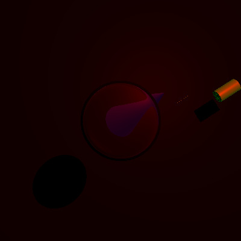
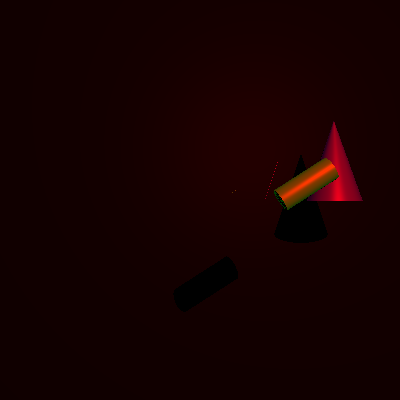
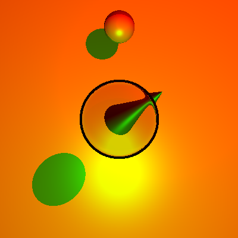
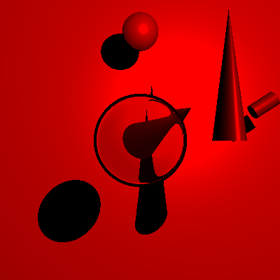

# Raytracer
## How to run
Run the 'make run' command in the current directory.
It will compile the program, and will run it as ./main.out < input.in > image.ppm and open image.ppm.
Program consumes an input file (eg input.in) and produces a ppm image file.

main.cpp contains the main() function

## Description
<html><head>
<meta http-equiv="content-type" content="text/html; charset=windows-1252"></head><body>

<h3>Introduction</h3>
The aim of this assignment is to create 1 level recursive ray tracer using C++.
The program takes an input file (input.in) which contains the specifications of the
scene to be created, and produces the corresponding output image file (image.ppm) in ppm format.

<h4>Input File Format</h4>
The first line of the input contains the resolution.
<ul><li>1: Width</li>
<li>1: Height</li>
</ul>
The second line contains 7 numbers for camera projection centered at origin.
<ul><li>1: z - coordinate of the projection center (focus)</li>
<li>2: z - coordinates of near and far plane</li>
<li>2: x - coordinates of left and right ends of the near plane</li>
<li>2: y - coordinates of bottom and top ends of the near plane</li>
</ul>
The follows the number (N) of point light sources which follow.
Each of N successive lines has 6 numbers - 3 for position and 3 for color for a light source.
Then follows the number (M) of objects to be created.
For each of M successive lines:
	<ul><li>The first number represents the type of model:
		<ul><li>1: Sphere</li>
		<li>2: Cone</li>
		<li>3: Cylinder</li>
		<li>4: Triangle</li>
		</ul>
	</li>
	<li>For sphere,cone and cylinder, 14 successive numbers occur: 
	3: translation (tx, ty, tz), 3: scaling (sx, sy, sz), 3: rotation (rx, ry, rz), 3: color (R,G,B scaled from 0 to 1), 1: mirrorness, 1: opacity 
	For triangle, 14 successive numbers occur: 
	9 for 3 vertices (3 for each (vx,vy,vz)), 3: color (R,G,B scaled from 0 to 1), 1: mirrorness, 1: opacity
	</li>
</ul>

<h4>Output File Format (ppm)</h4>
It is the standard and the easiest output format for image files.
http://netpbm.sourceforge.net/doc/ppm.html

<h2>Running examples:</h2>

<h3><u>Supersampling</u> </h3>
  

<h3><u>Reflection</u></h3>
   

<h3><u>Two lights (Red and Green)</u></h3>
  

<h3><u>Refraction</u></h3>
 

</body></html>
